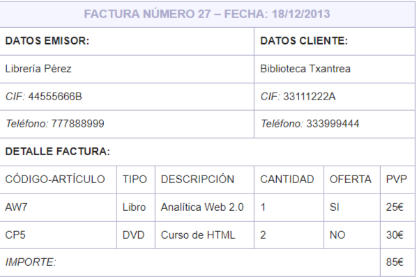

Escribir un documento XML con una DTD interna que represente la información contenida en la siguiente factura ficticia:

Consideraciones respecto a la DTD:

* Hay que guardar los datos del emisor de la factura agrupados. A continuación, los datos del cliente, también agrupados. Y finalmente, los datos de detalle donde se escriben (en líneas) los datos de cada artículo, así como, el importe total.
* Obsérvese que en cada línea se indica el código de un artículo, el tipo al que pertenece, su descripción, la cantidad facturada, si está de oferta o no, y el PVP (Precio de Venta al Público). Ahora bien, de los datos que aparecen en cada línea, sólo el código del artículo y el tipo deben representarse mediante atributos en la DTD.
* Se tiene que indicar que el código del artículo ha de ser único y obligatorio para cada artículo.
* Los posibles tipos de un artículo son Libro, DVD o Varios, no permitiéndose otro valor. Ahora bien, este atributo debe indicarse que es opcional.
* El importe también debe representarse por medio de un atributo, que debe ser obligatorio.
* En la DTD debe indicarse que al menos tiene que aparecer una línea de detalle y, para cada una de ellas, se tiene que guardar la información en el mismo orden en el que aparece en la factura.
* Para indicar si un artículo está de oferta, se debe utilizar un elemento vacío que, respecto a cada artículo, podrá aparecer (en el caso de sí estar de oferta) o no aparecer (en el caso contrario).
* Respecto al número de la factura y su fecha de emisión, deben representarse mediante atributos obligatorios donde se estime más apropiado.

**Genera el XML y el DTD interno**

