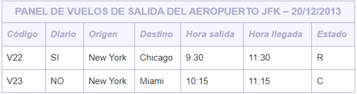

Escribir un documento XML con una DTD interna que represente la información contenida en la siguiente factura ficticia:

Consideraciones respecto a la DTD:
* Hay que guardar el nombre del aeropuerto, los datos de cada vuelo agrupados y la fecha del panel, en ese orden.
* En la DTD, sólo el código de un vuelo y su estado deben representarse mediante atributos.
* Se tiene que indicar que el código ha de ser único y obligatorio para cada vuelo.
* Los posibles estados de un vuelo son C (Cancelado), E (En hora), R (Retrasado). El valor por defecto debe ser E.
* En la DTD debe indicarse que al menos tiene que aparecer un vuelo y, para cada uno de ellos, se tiene que guardar la información en el mismo orden en el que aparece en el panel.
* Para indicar si un vuelo es diario, se debe utilizar un elemento vacío que, respecto a cada vuelo, podrá aparecer (en el caso de sí ser diario) o no aparecer (en el caso contrario).

**Generar el XML y el DTD interno**