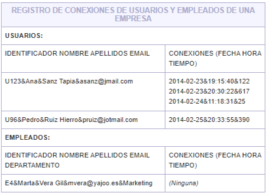

Escribir el fichero “conexiones.xsd” que valide al documento XML indicado a continuación y que se ha generado en base a la tabla siguiente. La tabla muestra la información del personal de los distintos departamentos de una empresa.



**El documento XML generado a partir de la tabla es el siguiente:**

```xml
<?xml version="1.0" encoding="UTF-8"?>
<registro xmlns:xsi="http://www.w3.org/2001/XMLSchema-instance" xsi:noNamespaceSchemaLocation="conexiones.xsd">
  <usuario identificador="U123">
    <apellidos-y-nombre>Sanz Tapia,Ana</apellidos-y-nombre>
    <email>asanz@jmail.com</email>
    <conexiones>
      <conexión fecha="2014-02-23" hora="19:15:40">122</conexión>
      <conexión fecha="2014-02-23" hora="20:30:22">617</conexión>
      <conexión fecha="2014-02-24" hora="11:18:31">25</conexión>
    </conexiones>
  </usuario>
  <usuario identificador="U96">
    <apellidos-y-nombre>Ruiz Hierro,Pedro</apellidos-y-nombre>
    <email>pruiz@jotmail.com</email>
    <conexiones>
      <conexión fecha="2014-02-25" hora="20:33:55">390</conexión>
    </conexiones>
  </usuario>
  <empleado identificador="E4">
    <apellidos-y-nombre>Vera Gil,Marta</apellidos-y-nombre>
    <email>mvera@yajoo.es</email>
    <conexiones/>
    <departamento>
      <marketing />
    </departamento>
  </empleado>
</registro>

```

Escribir el archivo **"registro.xsd”** que permita validar este XML con las siguientes restricciones:

* Todos los elementos y atributos son obligatorios, a menos que se indique lo contrario.
* Pueden aparecer de cero a ilimitados usuarios y, a continuación, de cero a ilimitados empleados.
* Usuario debe ser de un tipo definido por nosotros al que llamaremos tipoPersona, donde hay que definir los elementos apellidos-y-nombre, email y conexiones. Por otro lado, empleado ha de ser de otro tipo llamado tipoEmpleado, definido con los elementos apellidos-y-nombre, email y conexiones, departamento. El orden en que tienen que aparecer los elementos hijo de usuario y empleado, debe ser obligatoriamente el escrito en el documento XML.
* El valor del identificador debe ser una cadena formada por una letra "U" o "E" mayúscula, seguida de uno a cinco dígitos del 0 al 9.
* El valor del elemento apellidos-y-nombre debe ser una cadena de entre 1 a 30 caracteres (de la "a" a la "z", mayúsculas o minúsculas, o el carácter espacio en blanco) para los apellidos, seguida del carácter coma "," y de entre 1 a otras 20 letras (de la "a" a la "z", también mayúsculas o minúsculas, o el carácter espacio en blanco) para el nombre.
* El valor del email puede ser una cadena formada por 1 a 15 caracteres de la "a" a la "z", seguida del carácter "@", seguido de entre 1 a otras 25 letras de la "a" a la "z", seguidas del carácter punto "." y de entre otras 2 a 4 letras de la "a" a la "z".
* De cada usuario y empleado se reflejan sus conexiones, indicando para cada conexión la cantidad de segundos que duró, que debe ser un número entero mayor que cero. Hay que tener en cuenta que, como se puede ver en el documento XML, pueden aparecer desde cero hasta ilimitados elementos conexión.
* Respecto a los atributos fecha y hora, cada uno de ellos debe definirse del tipo que se considere más apropiado, de entre los proporcionados por XML Schema.
* Los posibles departamentos de la empresa a los que puede pertenecer un empleado son administración, informática o marketing. De tal forma que, para cada empleado, sólo uno de ellos debe escribirse en el documento XML mediante un elemento vacío, como en este caso se ha escrito <marketing />.
* No hay que definir más tipos de datos que los indicados en el ejercicio: tipoPersona y tipoEmpleado.
